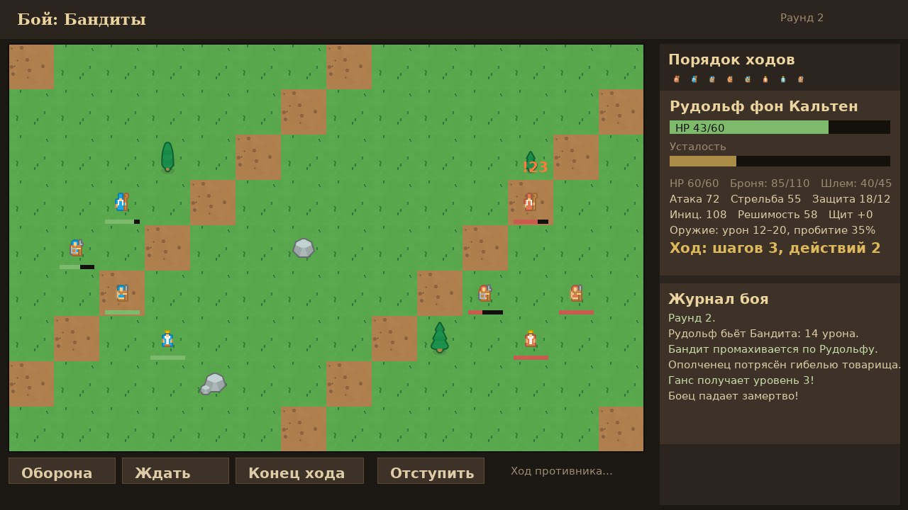
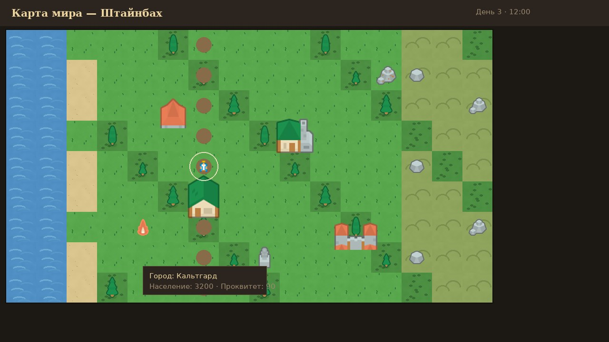

# STEINBACH — Сага о наёмниках

Фэнтезийная ролевая игра в духе **Battle Brothers**: вы ведёте отряд наёмников
по процедурно сгенерированному миру, нанимаете бойцов в городах, берёте
контракты, прокачиваете героев и собираете снаряжение.

Реализованы **карта мира, города, RPG-составляющая и тактические бои** на поле боя
по образцу Battle Brothers: очередь ходов по инициативе, перемещение по сетке,
броня с пробитием, усталость, мораль и ИИ противника.

---

## Как запустить

1. Скачайте/возьмите файл **`release/Steinbach.exe`**.
2. Запустите его на Windows — двойным кликом, никакой установки не требуется.
   (Вся графика и шрифты встроены прямо в exe.)

> Игра создана на 2D-движке **raylib** и собирается кросс-компилятором **Zig**,
> поэтому единственный артефакт — один exe-файл ~3 МБ.

---

## Управление

| Действие | Клавиша / мышь |
|---|---|
| Движение карты | `WASD` / стрелки, перетаскивание **ПКМ** |
| Масштаб карты | колесо мыши |
| Идти в точку | **ЛКМ** по местности |
| Войти в город / укрытие | **ЛКМ** по иконке (вблизи отряда) |
| Миникарта | ЛКМ по миникарте — перемотка камеры |
| Отряд | кнопка «Отряд» или `P` |
| Сохранить / Загрузить | `F5` / `F9` (или кнопки сверху) |
| Назад / закрыть окно | `Esc` |

---

## Что есть в игре

### 🗺 Карта мира
* Процедурная генерация: материки, острова, пляжи, равнины, леса, холмы, горы, болота, снега.
* 11 поселений: деревни, города, крепости и замки — со связывающими их дорогами.
* Локации для контрактов: руины, логова бандитов, шахты, святилища, хутора.
* Путешествие отряда с течением времени (день/час), поиск пути (A*).

### 🏘 Города
* **Таверна** — наём новобранцев с разными фонами, чертами и ценой.
* **Рынок** — покупка/продажа оружия, брони, щитов, припасов (цены зависят от процветания города).
* **Храм** — лечение ран и восстановление бойцов.
* **Гильдия** — контракты: доставка, охота, патруль, эскорт каравана.
* **Кузница** — ремонт снаряжения (в городах и крепостях).

### ⚔ Тактические бои


* Поле 14×9 клеток: бойцы расставляются по краям, на поле — деревья и камни (укрытия).
* **Порядок ходов по инициативе** (с учётом усталости), у бойца — шаги и **2 действия** за ход.
* Удар/выстрел тратит действие; шанс попадания `75 + атака − защита` (5..95%).
* **Броня головы и тела** с прочностью и **пробитием брони** у оружия — переплат урона идёт в здоровье.
* Усталость: движение и удары утомляют; переутомленный боец получает меньше действий.
* **Мораль**: гибель товарища потрясает бойцов — дважды потрясённый бежит с поля.
* Ранения головы, «оборона» (+15 защиты), отступление, **смерть бойцов навсегда** (с шансом выжить с травмой).
* **ИИ врагов**: цели выбираются по дистанции и ранениям, стрелки держат дистанцию,
  тяжёлые идут в ближний бой, перепуганные пытаются ретироваться.
* Шесть фракций противника: бандиты, разбойники, стража, культисты, дезертиры, ополчение.
* Бои происходят при атаке локаций, в случайных событиях и по контрактам «Охота»;
  победа даёт опыт, кроны, лут и повышение уровня бойцов.

### 🎨 Графика


Спрайты — **свободные ассеты CC0 с Kenney.nl** (наборы *Medieval RTS*,
*Scribble Dungeons*, *Cartography Pack*, иконки *OSARE*), скачанные из интернета;
тайлы местности и UI дорисованы процедурно (`tools/gen_textures.py`) в том же стиле.

### ⚔ RPG-составляющая
* До **12 наёмников** в отряде: имена, фоны (фермер, наёмник, дворянин, ветеран…), портреты.
* 8 характеристик: здоровье, выносливость, решимость, инициатива, мастерство боя,
  стрельба, защита, уклонение — плюс броня и урон снаряжения.
* **18 черт** характера (Крепыш, Трус, Ловкач, Пьяница…), **12 перков**, система **уровней и опыта**.
* Экипировка: голова, тело, оружие (в т.ч. двуручное и стрелковое), щиты; прочность и ремонт.
* Ранения с дебаффами и заживлением, настроение бойцов, жалование и продовольствие.
* Случайные события с проверками характеристик и **тактические бои** с отчётом о сражении.
* Сохранение/загрузка игры (`F5`/`F9`, файл `save1.sav` рядом с exe).

---

## Как собрать из исходников

```bash
# зависимости: python3 (Pillow, numpy — только генерация текстур), Zig
pip install ziglang Pillow numpy

./build.sh        # → release/Steinbach.exe
./run_tests.sh    # автотесты логики и интерфейса (нужен gcc)
```

Часть текстур генерируется **процедурно** скриптом `tools/gen_textures.py`
(тайлы местности, портреты, UI, заставка), спрайты лежат в `assets/sprites/`;
всё встраивается в exe скриптом `tools/embed_assets.py`.
Шрифты — DejaVu (лицензия Bitstream Vera).

**Кредиты спрайтов (все — CC0):** Kenney Vleugels (Kenney.nl) — *RTS Pack: Medieval*,
*Scribble Dungeons*, *2D Game Icons (Cartography)*; OpenGameArt — *OSARE weapon icons*.

## Структура проекта

```
assets/textures/     — сгенерированные текстуры (PNG)
assets/sprites/      — скачанные CC0-спрайты (Kenney, OpenGameArt)
assets/fonts/        — шрифты (TTF, кириллица)
src/                 — код игры (C):
    game.h           — типы и состояние мира
    worldgen.c       — генерация карты, биомы, дороги, A*
    units.c          — наёмники, черты, перки, уровни
    items.c          — предметы и снаряжение
    towns.c          — города: рынок, найм
    contracts.c      — контракты
    events.c         — события в пути
    battle.c         — тактический бой: сетка, удары, ИИ, мораль
    render_battle.c  — экран боя
    econ.c           — жалование, еда, настроение
    travel.c         — движение отряда и время
    save.c           — сохранение/загрузка
    ui.c, render.c   — интерфейс и экраны (raylib)
    main.c           — точка входа и игровой цикл
tests/               — автотесты (логика + бой + смоук-тест UI)
third_party/raylib_src/ — движок raylib 5.5 (зевендорен)
tools/               — генератор текстур и утилита встраивания ресурсов
release/Steinbach.exe  — готовая игра для Windows
```

Приятной игры! ⚔
